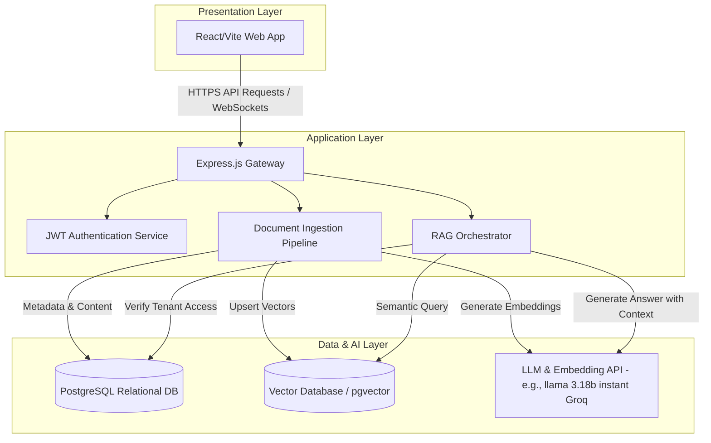
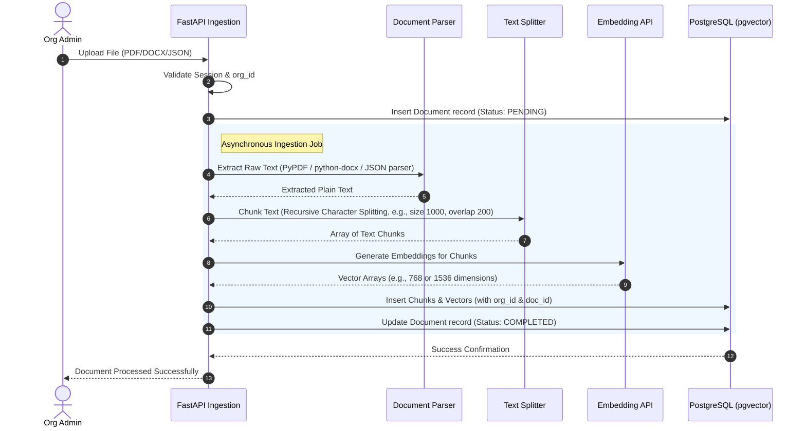
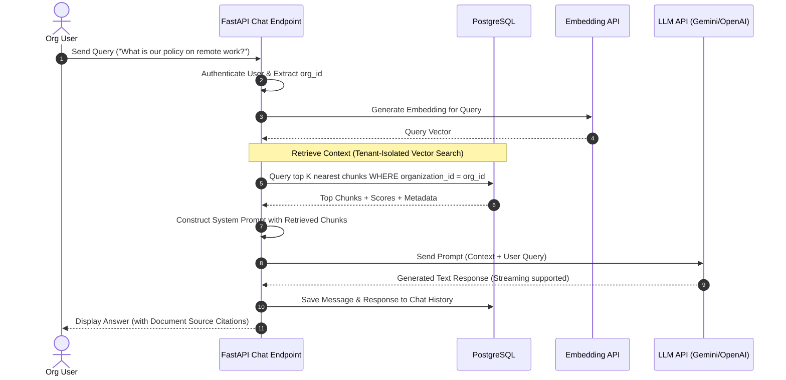
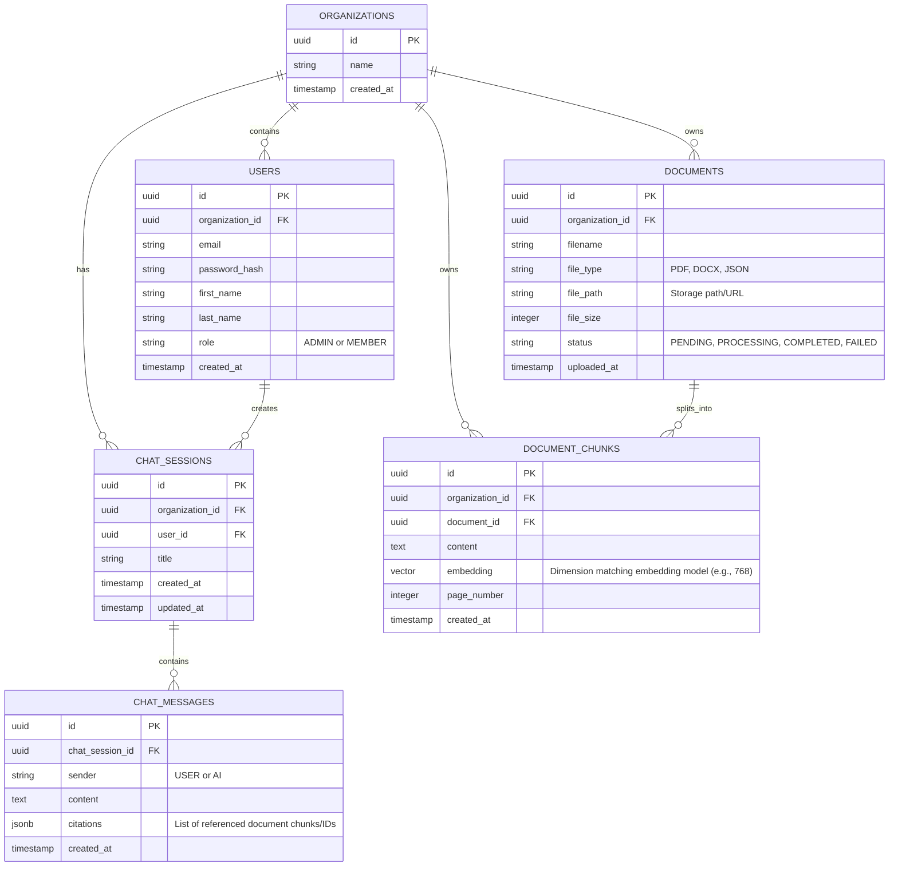

# NeuraDocs: Technical Architecture Document

NeuraDocs is a multi-tenant Retrieval-Augmented Generation (RAG) platform designed to enable organizations to upload proprietary documents (PDF, DOCX, JSON) and query them securely via an AI chatbot. Crucially, the platform enforces strict data isolation so that users can only access and query documents belonging to their respective organizations.

---

## 1. System Architecture

The following diagram illustrates the high-level architecture of NeuraDocs. The system follows a decoupled three-tier architecture:
1. **Frontend Presentation Layer**: A responsive React/Vite web application.
2. **Backend Application Layer**: An express.js service (JavaScript) service that handles authentication, file processing, database operations.
3. **Data & AI Layer**: PostgreSQL (relational metadata), Vector Database (embeddings storage), and LLM API (for embeddings and chat generation). This layers includes ai development so it will use python fastapi.



---

## 2. Multi-Tenancy & Data Isolation Strategy

Data isolation is the most critical security constraint of NeuraDocs. A failure in isolation means one organization can access another organization's intellectual property.

### 2.1 Relational Data Isolation
We will adopt a **Logical Separation (Shared Database, Shared Schema with Row-Level Security)** model using PostgreSQL.
* Every tenant is represented by an `Organization`.
* All relevant tables (Users, Documents, Chat Sessions, Messages) contain an `organization_id` foreign key.
* PostgreSQL **Row-Level Security (RLS)** policies will be applied to guarantee that a database connection operating under a specific tenant context cannot read or write data belonging to other tenants, even if a software bug accidentally omits a `WHERE` clause.

### 2.2 Vector Data Isolation
For storing and querying vector embeddings, we have two primary options:
1. **Metadata Filtering (Single Vector Collection)**: Store all embeddings in a single collection/table. Every vector includes an `organization_id` in its metadata. All vector searches *must* apply a strict metadata filter: `organization_id == user.organization_id`.
2. **Namespace / Collection Partitioning**: Create a separate vector collection or namespace for each organization.

> [!IMPORTANT]
> **Selected Approach**: We will use **Metadata Filtering on PostgreSQL with `pgvector`** (or a dedicated vector DB like Qdrant/Pinecone with metadata filtering). Using `pgvector` allows us to leverage PostgreSQL's Row-Level Security directly on vector search operations. This unifies our relational and vector security boundaries into a single system, significantly reducing the risk of data leaks.

---

## 3. Data Ingestion Pipeline

The ingestion pipeline handles file uploads, parsing, chunking, embedding generation, and indexing.



### 3.1 Document Chunking Strategy
* **Text Chunks**: Split documents into chunks of ~1,000 characters with an overlap of 200 characters to preserve context across boundaries.
* **Metadata Attachment**: Each chunk stored in the database must inherit:
  * `organization_id` (Crucial for tenant filter)
  * `document_id` (For source citation)
  * `page_number` (Where applicable, for UX citation)

---

## 4. Query & RAG Workflow

When a user submits a query to the chatbot, the backend orchestrates semantic search and LLM context synthesis.



---

## 5. Relational Database Schema Design

Below is the entity-relationship design for the PostgreSQL database.



---

## 6. Security & Authentication Model

1. **Identity & Access Management**: JWT (JSON Web Tokens) will be issued upon login. The payload will include:
   ```json
   {
     "sub": "user_uuid_here",
     "org_id": "org_uuid_here",
     "role": "ADMIN",
     "exp": 1718448994
   }
   ```
2. **Access Control (RBAC)**:
   * `ADMIN`: Can upload files, view list of uploaded files, delete files, and manage organization users.
   * `MEMBER`: Can query the chatbot and view their own chat histories. Cannot upload or delete files.
3. **Data Isolation (PostgreSQL RLS Rules)**:
   ```sql
   -- Example RLS Policy for Document Chunks
   ALTER TABLE document_chunks ENABLE ROW LEVEL SECURITY;
   
   CREATE POLICY tenant_isolation_policy ON document_chunks
     USING (organization_id = NULLIF(current_setting('app.current_organization_id', true), '')::uuid);
   ```

---

## 7. Recommended Technology Stack

* **Frontend**:
  * **Framework**: React.js with Vite (TypeScript).
  * **Styling**: Vanilla CSS or TailwindCSS with CSS variables for dynamic custom styling. Dark-mode first design matching modern AI web applications.
  * **State & Networking**: Axios or fetch for API communication, React Markdown for rendering bot answers.
* **Backend**:
  * **Framework**: Expres.js connnected with Python 3.11+ with **FastAPI**. High performance, native async support, and excellent ecosystem for RAG tools. It will be based on micro-service architecture.
  * **Document Parsing**: `pypdf` (or `pdfplumber`), `python-docx`, and native Python `json`.
  * **Orchestration**: Direct integration with llama 3.18b instant model from groq.
* **Database**:
  * **Primary DB**: **PostgreSQL** with the `pgvector` extension. This simplifies storage by placing relational tables and vector embeddings in a single database while maintaining strict RLS isolation.

---

## 8. Key API Endpoint Specifications

### 8.1 Authentication & Tenants
* `POST /api/auth/register` - Register a new organization and admin user.
* `POST /api/auth/login` - Authenticate user, return JWT.

### 8.2 Document Management (Admin Only)
* `POST /api/documents/upload` - Upload PDF/DOCX/JSON files. Triggers background parsing and ingestion.
* `GET /api/documents` - Get list of uploaded documents.
* `DELETE /api/documents/{id}` - Delete a document and its associated vectors.

### 8.3 Chat & Retrieval
* `POST /api/chat/sessions` - Create a new chat session.
* `GET /api/chat/sessions` - List chat sessions for the authenticated user.
* `GET /api/chat/sessions/{id}/messages` - Retrieve history for a specific chat session.
* `POST /api/chat/sessions/{id}/query` - Submit a message to the RAG system (supports streaming responses).

---

## 9. Next Steps & Implementation Plan

1. **Phase 1: DB & Auth Setup**: Establish PostgreSQL database, define relational schemas, set up migration scripts, and configure JWT authentication.
2. **Phase 2: Ingestion Service**: Develop the file parsing engine for PDF, DOCX, and JSON. Implement text chunking and vector storage with `pgvector`.
3. **Phase 3: RAG Core Engine**: Build the semantic search query parser and hook up the LLM API to synthesize answers using isolated metadata context.
4. **Phase 4: Frontend Development**: Build the organization admin dashboard (file upload, status indicators) and the consumer-grade chatbot UI.
5. **Phase 5: E2E Verification & Security Audits**: Run integration tests verifying that users from Tenant B cannot access Tenant A's documents, even under heavy query loads.
